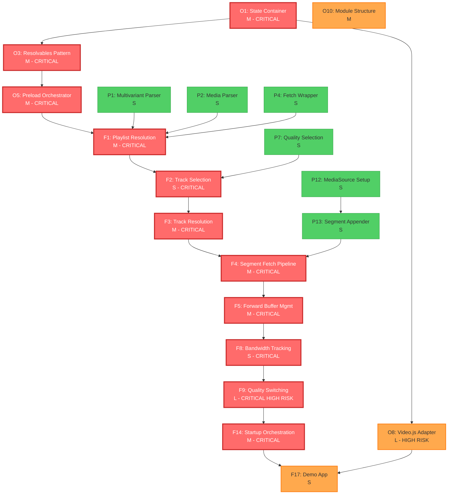
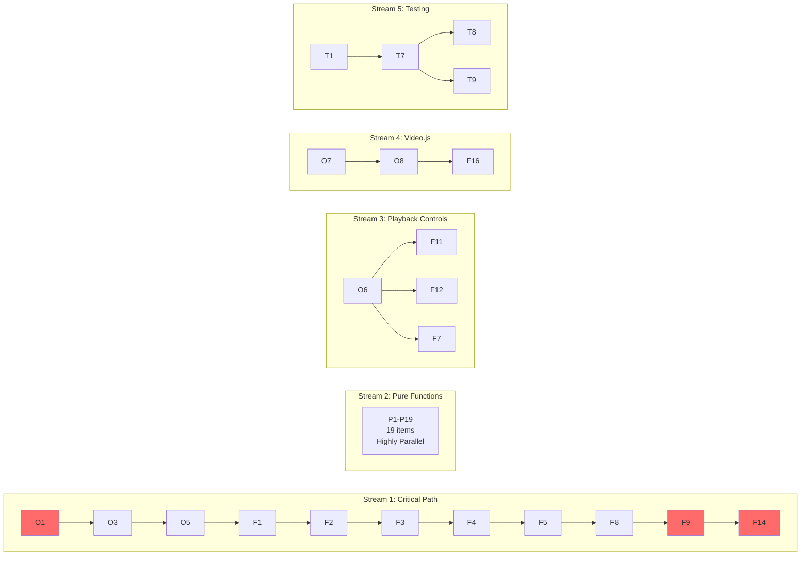
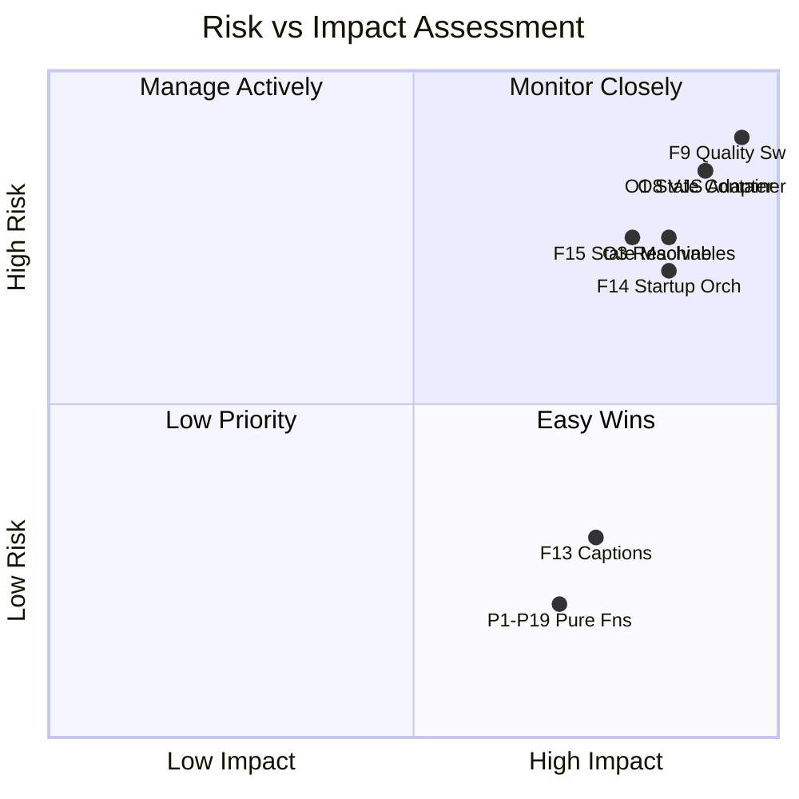
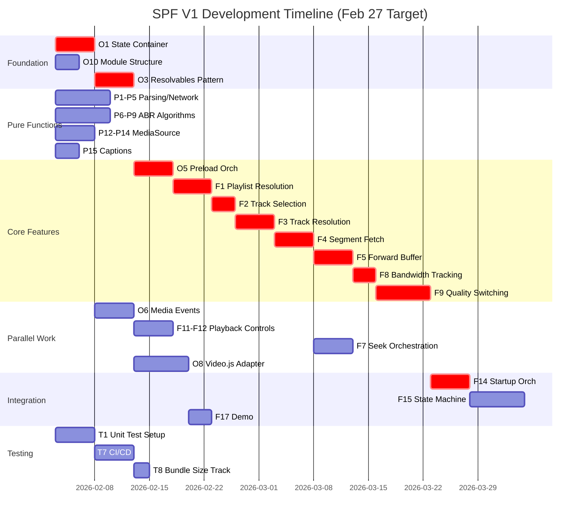

# SPF Dependency Graph (Visual)

## Critical Path Visualization

## Parallel Work Streams

## Risk Matrix

## Timeline Gantt Chart (6-Week Plan)

---

## Key Findings

### Critical Path (Must Complete Sequentially)
**15 items:** O1 → O3 → O5 → F1 → F2 → F3 → F4 → F5 → F8 → F9 → F14

**Bottleneck Items:**
- 🔴 **F9 (Quality Switching)** - L complexity, on critical path
- 🔴 **O8 (Video.js Adapter)** - L complexity, needed for demo
- 🟡 **O1 (State Container)** - M complexity, blocks 40+ items

### Parallelization Potential
- ✅ **19 Pure items** can be done simultaneously (Week 1-2)
- ✅ **5 parallel streams** can run concurrently after O1
- ✅ **~40% of work** is highly parallelizable

### Risk Mitigation
1. **Start O1 immediately** - Everything depends on it
2. **Assign best engineer to F9** - Highest complexity on critical path
3. **Spike O8 early** - Unknown integration complexity
4. **Parallelize Pure functions** - Quick wins, unblock later work

### Flexibility for Feb 27
If running behind, these can slip to March:
- F6 (Back Buffer), F10 (Manual Quality), F18 (Docs)
- O4 (Deduplication), O9 (Cleanup), O13 (Error Handling)
- T10 (Perf Benchmarks), P16 (Caption Validator)

**~9 items (15%)** can be deferred without breaking core functionality.
