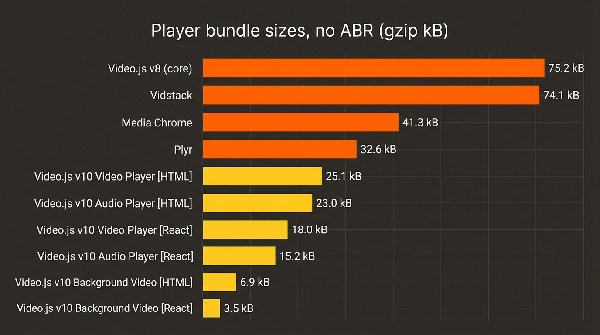
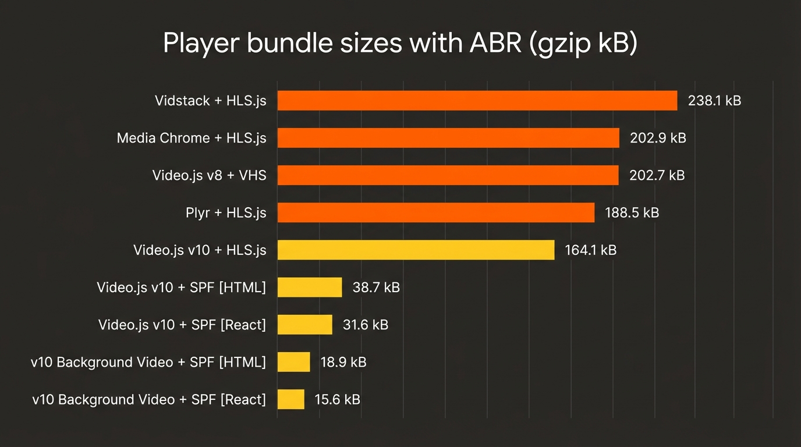
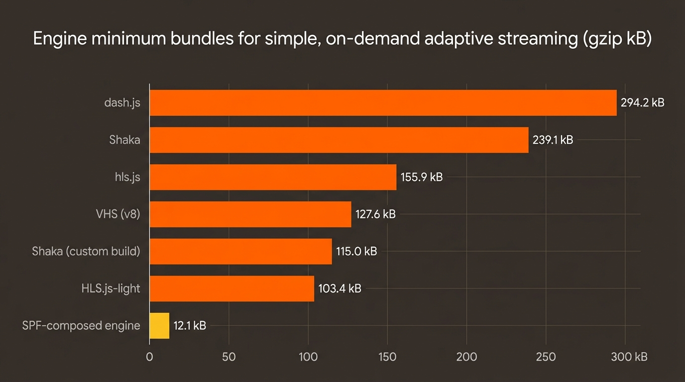
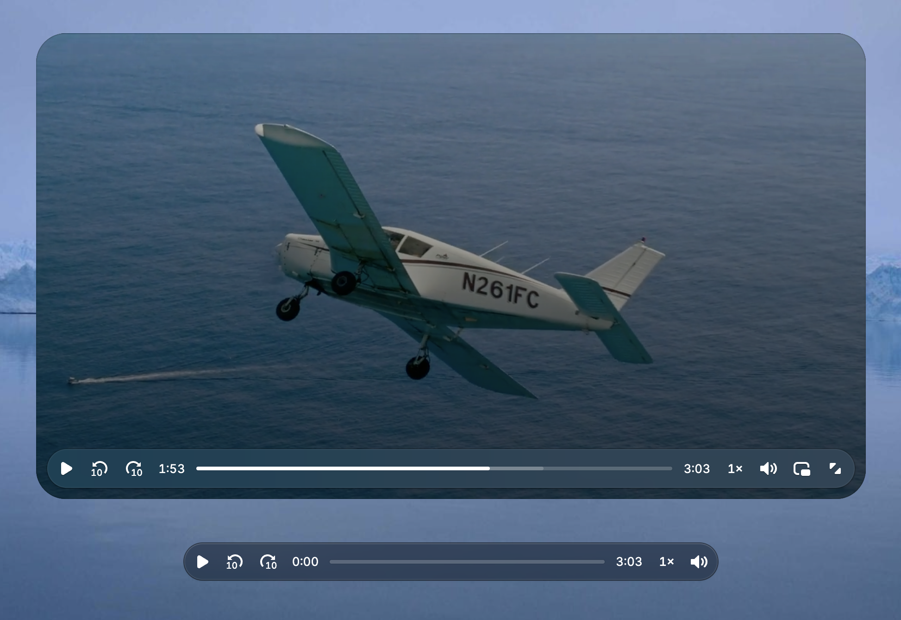
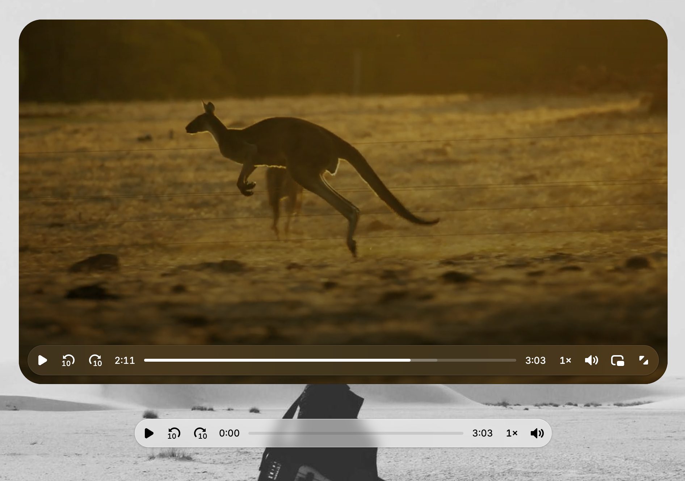
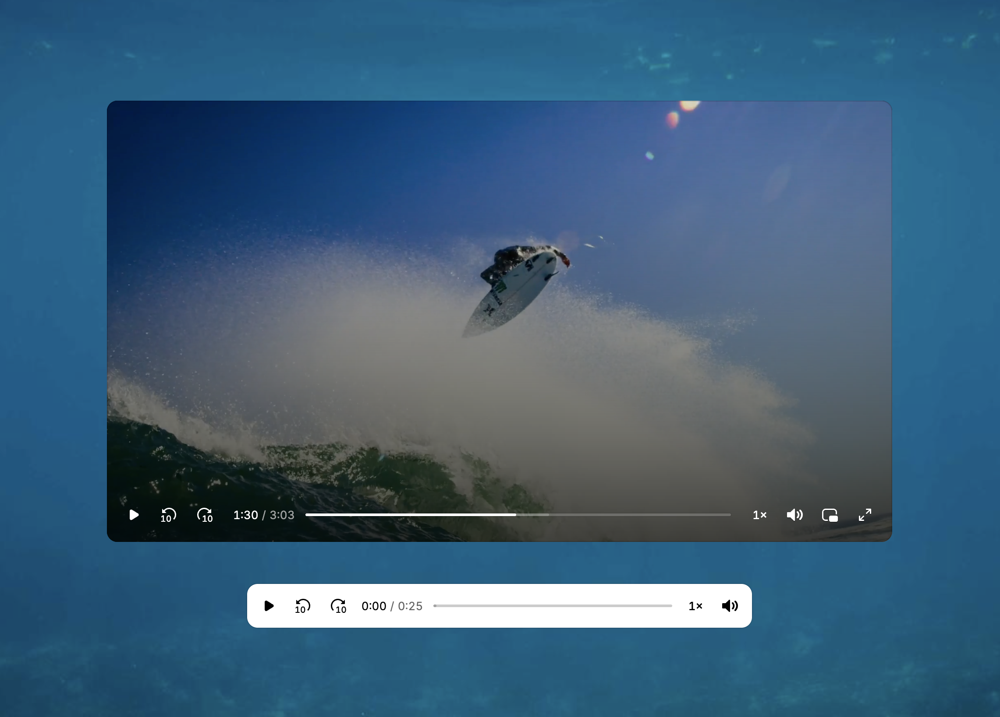
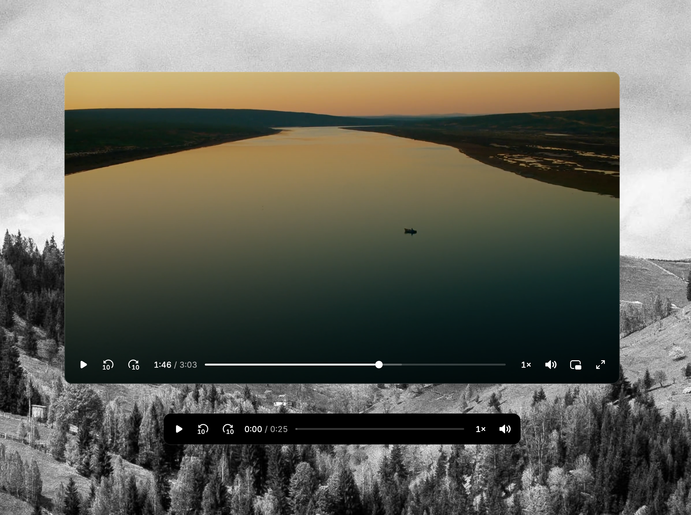
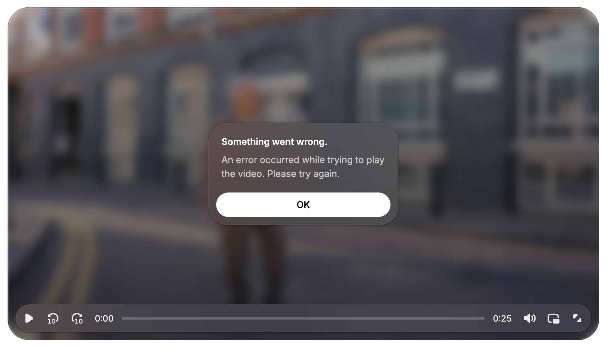
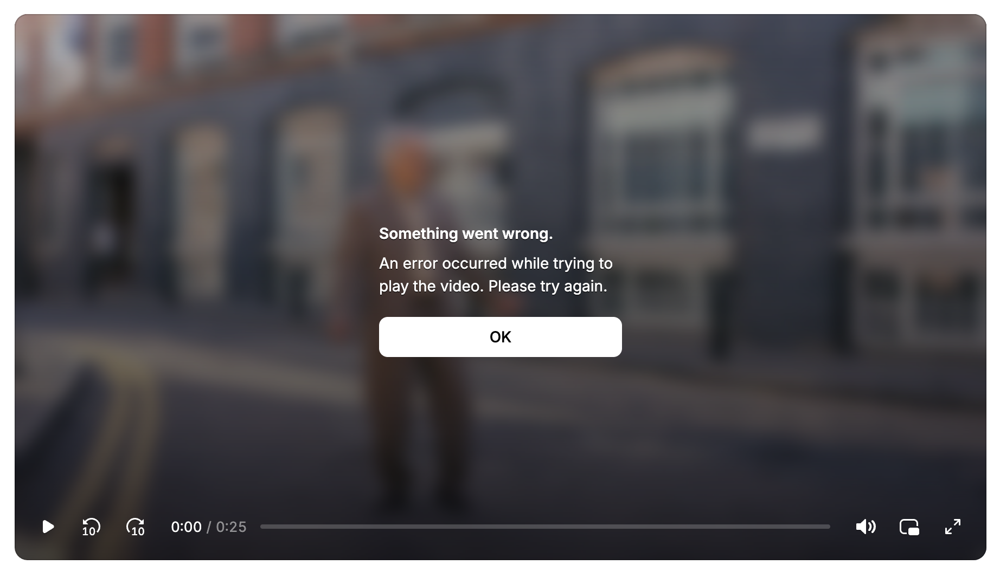
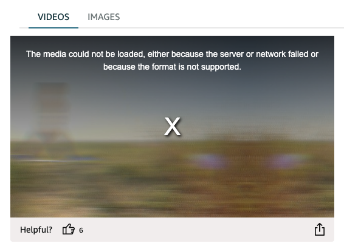

Today we're excited to release the Video.js v10.0.0 beta. It's the result of a rather large ground-up rewrite, not just of Video.js ([discussion](https://github.com/videojs/video.js/discussions/9035)) but also of [Plyr](https://github.com/sampotts/plyr/discussions/2871), [Vidstack](https://github.com/vidstack/player/discussions/1747), and [Media Chrome](https://www.mux.com/blog/from-media-chrome-to-video-js-v10-the-evolution-of-html-first-video-players), through a rare teaming-up of open source projects and people who care a lot about web video, with a combined 75,000 github stars and tens of billions of video plays monthly.

I built Video.js 16 years ago to help the transition from Flash to HTML5 video. It's grown a lot since then with the help of [many people](https://github.com/videojs/video.js/graphs/contributors), but the codebase and APIs have continued to reflect a different era of web development. This rebuild modernizes the player both for how developers build today and sets up the foundation for the next significant transition to AI-augmented features and development.

We've focused on:

- Shrinking bundle sizes, and then shrinking them more (88% reduction in default bundle size)
- Allowing deep customization using the familiar development patterns of your chosen framework — including new first-class React, Typescript, and Tailwind support
- Making the defaults look beautiful and perform beautifully (The experts are calling me saying "Sir, how did you make it so great?". It's incredible, really.)
- Designing the codebase and docs so AI agents building your player alongside you can actually be good at it

We're pretty sure it works differently from what you've come to expect of a web media player, while we hope it *feels* more familiar to how you actually build.

**HTML**

```html
<video-player>
  <video-skin>
    <video slot="media" src="video.mp4"></video>
  </video-skin>
</video-player>
```

**React**

```tsx
import '@videojs/react/video/skin.css';

import { createPlayer } from '@videojs/react';
import { videoFeatures, VideoSkin, Video } from '@videojs/react/video';

const Player = createPlayer({
  features: videoFeatures,
});

function App() {
  return (
    <Player.Provider>
      <VideoSkin>
        <Video src="video.mp4" />
      </VideoSkin>
    </Player.Provider>
  );
}
```

## &lt;small&gt;Bundle&lt;/small&gt;

One of the biggest complaints about video players today is their file size, often weighing in around 1MB minified and hundreds of KB gzipped. Players are sneakily-complex applications so there's only so many bytes you can shave off, but legacy players were built in times before smart bundlers, tree shaking, and other size-saving opportunities. They carry with them many features you may not be actively using.

The Video.js v10 default player is now **88% smaller** than the size of the previous version's (v8.x.x) default. A good chunk of those savings come from the decision to unbundle adaptive bitrate (ABR) support, which you could remove in the previous version by instead importing from `video.js/core` , but the majority of video.js installs just use the default bundle while also *not* using the adaptive streaming features. Comparing more similar apples, with ABR removed, the v10 default video player (HTML) is still **66% smaller** than the size of the previous version, getting even smaller from there depending on which bundle you need.



| player | minified (kB) | gzip (kB) | notes |
| --- | --- | --- | --- |
| Video.js v8 (core) | 260.5 | 75.2 |  |
| Vidstack | 237.4 | 74.1 |  |
| Media Chrome | 175.5 | 41.3 |  |
| Plyr | 109.8 | 32.6 |  |
|  |  |  |  |
| **Video.js v10** Video Player [HTML] | 97.4 | 25.1 |  |
| **Video.js v10** Audio Player [HTML] | 85.8 | 23.0 |  |
| **Video.js v10** Video Player [React] | 62.0 | 18.0 |  |
| **Video.js v10** Audio Player [React] | 49.2 | 15.2 |  |
| **Video.js v10** Background Video [HTML] | 22.2 | 6.9 |  |
| **Video.js v10** Background Video [React] | 10.7 | 3.5 |  |

### v10 Engine (vroooom)

While the previous section was comparing players *without* ABR, a lot of the weight of a fully-featured video player comes from the *streaming engine* which is needed to handle adaptive bitrate (ABR) formats like HLS and DASH — for manifest parsing, segment loading, buffer management, ABR logic, codec detection, MSE integration, DRM, server-side ads, and more. Similar to players, traditional streaming engines have monolithic architectures making it difficult to get the bundle size smaller.

As part of v10 we've started a new engine project called SPF 😎 (Streaming Processor Framework), which is a framework built around functional components that are composed into purpose-built, smaller streaming engines. For example if you have a short-form video app with simple adaptive streaming needs, your engine won't ship with any code for DRM and ads.

**For a simple HLS use case, Video.js v10 using SPF is only 19% the file size of Video.js v8 including adaptive bitrate streaming (ABR).**



| player | minified (kB) | gzip (kB) | notes |
| --- | --- | --- | --- |
| Vidstack + HLS.js | 764.3 | 238.1 |  |
| Media Chrome + HLS.js | 701.2 | 202.9 |  |
| Video.js v8 + VHS* | 697.0 | 202.7 | *VHS is bundled by default |
| Plyr + HLS.js | 614.0 | 188.5 |  |
|  |  |  |  |
| **Video.js v10 +** HLS.js | 526.5 | 164.1 |  |
| **Video.js v10 +** SPF [HTML] | 144.6 | 38.7 |  |
| **Video.js v10 +** SPF [React] | 107.3 | 31.6 |  |
| **v10** Background Video **+** SPF [HTML] | 61.2 | 18.9 |  |
| **v10** Background Video **+** SPF [React] | 49.2 | 15.6 |  |

Comparing engines to engines you get a clearer picture of the story. The other engines are very difficult to get any smaller without forking them, while the engine composed using SPF only includes what's needed for simple adaptive streaming using HLS, **making it only 12% the file size of even HLS.js-light**.



| engine | minified (kB) | gzip (kB) | notes | v10 compatible |
| --- | --- | --- | --- | --- |
| [dash.js](https://github.com/Dash-Industry-Forum/dash.js) | 962.1 | 294.2 | DASH only | ✅ |
| [Shaka](https://github.com/shaka-project/shaka-player) | 753.0 | 239.1 | HLS and DASH support | ✅ |
| [hls.js](https://github.com/video-dev/hls.js/) | 503.4 | 155.9 | HLS only | ✅ |
| [VHS](https://github.com/videojs/http-streaming) (v8) * | 434.4 | 127.6 | * Requires video.js; not standalone. HLS and DASH support | ✅ |
| Shaka ([custom build](https://github.com/shaka-project/shaka-player/blob/main/build/README.md) **) | 350.0 | 115.0 | ** Shaka can be made smaller with a Closure Compiler custom build, not an npm import. This build size targets "simple" ABR. | ✅ |
| HLS.js-light | 328.5 | 103.4 | Removes DRM, subs, alt-audio, CMCD, interstitials | ✅ |
|  |  |  |  |  |
| **SPF-composed engine** | **38.5** | **12.1** | Includes only what's needed for "simple" ABR | ✅ |

To be clear, the immediate goal isn't for SPF to replace the full-featured engines like HLS.js for advanced streaming use cases, and in fact v10 works with all these streaming engines today. The goal is to achieve much smaller file sizes for common, simpler use cases. At the same time we think a lot more sites and apps could benefit from simple ABR, and we want SPF to lower the file size cost of using it.

### But wait, there's more!

With v10 the file size story doesn't actually start with the baseline builds. The library is built for composing a player with only what's needed, allowing for simple use cases to be even smaller.

For example here's a simple React "hello world" with just a video and play button, weighing in at **\<5 kB** **gzipped**.

```tsx
import { createPlayer, features } from '@videojs/react';
import { Video } from '@videojs/react/video';

const Player = createPlayer({
  features: [features.playback],
});

function App() {
  const store = Player.usePlayer();
  const paused = Player.usePlayer((s) => s.paused);

  return (
    <Player.Provider>
      <Player.Container>
        <Video src="video.mp4" />
        <button onClick={() => (paused ? store.play() : store.pause())}>
          {paused ? 'Play' : 'Pause'}
        </button>
      </Player.Container>
    </Player.Provider>
  );
}
```

You could for sure build that example with an even smaller file size, but it's meant to show that the the player infrastructure is minimal, while supporting much more advanced and custom players.

In v10 we first split State, UI, and Media into their own components that work together through API contracts instead of monolithic controllers and overloaded player objects. Each major component is optional and easily swappable or configurable. UI and Media components can also be used just by themselves.

The `createPlayer` function takes an array of `features` (like [Zustand store slices](https://zustand.docs.pmnd.rs/learn/guides/slices-pattern)) to build up its internal state capabilities. If your player doesn't need `audio` it doesn't have to bundle the code for `volume` and `mute`. In legacy players this wasn't possible without forking the code.

Don't need UI or want to build your own? Just delete the skin, it's right there in your code. In legacy players, setting `controls=false` still results in a bundle with all the controls. With v10 if you don't import a component, it doesn't exist in your bundle.

File size is far from the only important performance metric when it comes to video players, but it's one that can get away from you quickly if you don't architect for it upfront. There's still improvements we can make but we're really happy with the results of the new architecture so far.

## Player UI customization you might actually enjoy

Video.js v10 beta comes with a few polished, complete skins (control sets) you can use out of the box. But we hope you don't stop there because we've put a lot of effort into making the UI components themselves great to work with in any framework. We've started with React and Web Components, but hope to move quickly into supporting other popular JS frameworks directly.

When you're ready to go deeper, you can *eject* any skin and get the full source code in your framework's language — real components you own and modify, inspired by [shadcn/ui](https://ui.shadcn.com/). For Beta "eject" just means copy/paste from the docs, but a fancier CLI option is on the way.

v10's UI is built with unstyled UI primitives, inspired by libs like [Base UI](https://base-ui.com/) and [Radix](https://www.radix-ui.com/), which means they get out of your way when you're trying to do anything custom. Each component outputs a single HTML element, so you have direct access to everything happening in the UI.

**React**

```tsx
<TimeSlider.Root className="slider">
  <TimeSlider.Track className="slider-track">
    <TimeSlider.Buffer className="slider-buffer" />
    <TimeSlider.Fill className="slider-fill" />
  </TimeSlider.Track>
  <TimeSlider.Thumb className="slider-thumb" />
</TimeSlider.Root>
```

**HTML**

```html
<media-time-slider class="slider">
  <media-slider-track class="slider-track">
    <media-slider-buffer class="slider-buffer"></media-slider-buffer>
    <media-slider-fill class="slider-fill"></media-slider-fill>
  </media-slider-track>
  <media-slider-thumb class="slider-thumb"></media-slider-thumb>
</media-time-slider>
```

They're more verbose, and as a long time HTML-er I'll admit I was not a fan at first glance. But after building a player skin with them I understood why *this is the way*. For example, in the previous version (v8) the timeline thumb/handle was a pseudo-element on a nested child. You overrode it through inspecting the player's output, using specificity and a font-size for dimensions.

```css
.video-js .vjs-play-progress:before {
  font-size: 0.9em;
  background: white;
  border-radius: 50%;
  z-index: 1;
}
```

In v10, it's a real element with a class you control.

```css
.slider-thumb {
  width: 0.75rem;
  height: 0.75rem;
  background: white;
  border-radius: 50%;
}
```

## Design

The previous version's default skin is used billions of times every month, and yet we put relatively little design effort into it. At the time I hoped devs would style it and make it their own, and then they didn't.

For v10, Sam Potts (creator of [Plyr](https://plyr.io/), 29,000 GitHub stars largely on the strength of its design) designed the new skins, and will continue to invest in them and iterations over time. The beta ships two skins: a default skin with a frosted aesthetic and a minimal skin for developers who want a clean starting point, both with refined controls, smooth interactions, and thoughtful animations

**Default skins theme** (VideoSkin and AudioSkin)





**Minimal skins theme** (MinimalVideoSkin and MinimalAudioSkin)





One detail I love is the error dialog, where the visual treatment matches the skin. I'm sure that feels tiny and simple, but in Video.js history this level of detail was so far down the priority list that for a decade the error dialog has been my big ugly text 'X', for every skin. So when I see these new error dialogs it helps confirm we're all setting the bar higher, and I'm loving it.

**Default**



**Minimal**



**Amazon.com featuring the version 8 error dialog "X" (I forced the error for the screenshot)**



*(Amazon, I can help you upgrade! You have all of my contact info.)*

## Presets for use cases (video, audio, background)

While these beta skins are a great starting point, they're just the beginning.

If you wanted to build a podcast player with Video.js v8, you'd start with a video player, strip out the video-specific parts, add some specific audio features, and then spend real time on UI customization to get something that actually looked and felt like a podcast player. Same story for a background video on a landing page, or a short-form swipeable player, or a classroom course player.

We do actually know what people are building, believe it or not. Not just the individual features, but the specific combinations that tend to show up together. A TV streaming app needs different things than a hero background video, which needs different things than a podcast player. And those combinations are pretty consistent across the web.

So in v10 we're packaging them up as presets. A preset is a purpose-built combination of skin, features, and media configuration for a specific use case. Instead of assembling a player from scratch, you'll pick the preset closest to what you're building and start there.

The beta ships three:

A default video preset (general website video, the kind of thing you might otherwise use the HTML video tag for)

```html
<video-player>
  <video-skin>
    <video slot="media" src="video.mp4"></video>
  </video-skin>
</video-player>
```

```jsx
const Player = createPlayer({
  features: videoFeatures,
});

function App() {
  return (
    <Player.Provider>
      <VideoSkin>
        <Video src="video.mp4" />
      </VideoSkin>
    </Player.Provider>
  );
}
```

A default audio preset (same idea but for the audio tag)

```html
<audio-player>
  <audio-skin>
    <audio src="audio.mp3"></audio>
  </audio-skin>
</audio-player>
```

```jsx
const Player = createPlayer({
  features: audioFeatures,
});

function App() {
  return (
    <Player.Provider>
      <AudioSkin>
        <Audio src="audio.mp3" />
      </AudioSkin>
    </Player.Provider>
  );
}
```

And a background video preset. Background video is where this concept really starts to click, because a background video needs layout but doesn't need controls and doesn't need audio. Rather than handing you a full player and asking you to remove things, we just give you the right player for the job.

```html
<background-video-player>
  <background-video-skin>
    <background-video></background-video>
  </background-video-skin>
</background-video-player>
```

```jsx
const Player = createPlayer({
  features: backgroundVideoFeatures,
});

function App() {
  return (
    <Player.Provider>
      <BackgroundVideoSkin>
        <BackgroundVideo src="video.mp4" />
      </BackgroundVideoSkin>
    </Player.Provider>
  );
}
```

This is also where the compositional architecture pays off. The preset gets you started fast. The composable foundation underneath means you can still add, remove, or replace anything. You get a real starting point without giving up any of the flexibility.

Over time we'll expand into more use cases: creator-platform players, short-form swipeable video, educational course players. If there's a use case you'd love to see, let us know.

## How we're thinking about AI

The last year, and even just the last few months specifically have been a wild time to be building a new project like this. We're of course excited for how AI will create interesting interactive player features in the months and years to come and we have a few ideas of what those will be. For Beta, however, we've been focused on the *agent experience* of building video.js-based players with the help of AI.

- Less-abstracted components and unstyled UI primitives so agents can do more with the code right in your project and need fewer external docs
- [llms.txt](https://videojs.org/llms.txt) to make navigating Video.js docs more efficient, including [framework-specific llms.txt](https://vjs10-site.netlify.app/docs/framework/react/llms.txt)
- Markdown versions of every [individual doc](https://vjs10-site.netlify.app/docs/framework/react/reference/play-button.md). If your agent hits our site with the accept: text/markdown header — as many like Claude Code do — we'll send the markdown version of the page, saving your agent loads of unnecessary context bloat.
- A growing set of AI skills in the repo, currently helping us build and soon will help you build too.

In writing this part and getting input from the team I found we actually have a lot to say about our experience building with AI and the many ways we put it to use, so keep an eye out for a followup post on that topic.

## Try the beta

A few things to know:

- **The APIs are not quite stable.** This is a beta, so some interfaces will change before GA. Build with it, experiment, give us feedback, put it on simple projects. It's not yet the time to do a major migration.
- **The features may be limited.** You might be surprised by which features aren't supported yet and also by which already are. We *are* building from a base of four existing players, but our goal for reaching beta was simple website playback functionality. It's accessible and supports captions, and already works with many formats and streaming services, but things like settings menus are still on their way.
- **We really want your feedback.** File issues on [GitHub](https://github.com/videojs/video.js), join the conversation on [discord](https://discord.gg/KX6dhX2mYJ), tell us what works and what doesn't. In general, people seem to get less engaged with JS "widgets" like a video player compared to JS frameworks, so please don't be shy. Your input is really valuable.

If you're starting something new, this is a good time to try v10. Go to [videojs.org](http://videojs.org) and check out the [installation guide](https://videojs.org/docs/).

If you're running a previous version in production, sit tight. We'll have migration guides before we ask you to move.

## What's coming

We're aiming for mid-2026 for GA. Between now and then:

- Feature parity with the capabilities developers rely on in the previous version of Plyr, Vidstack and Media Chrome.
    - Planning ads support later in 2026. Ads are complicated.
- Migration guides for Video.js v8, Plyr, Vidstack, and Media Chrome
- More player presets for common use cases

## Big thanks to…

[@cpilsbury](https://github.com/cjpillsbury), [@decepulis](https://github.com/decepulis), [@esbie](https://github.com/esbie), [@luwes](https://github.com/luwes), [@mihar-22](https://github.com/mihar-22), [@sampotts](https://github.com/sampotts) for building the thing — who needs AI when you have the absolute best team of people in the world. I'm aware that makes no sense.

That said, [@claude](https://github.com/claude). I don't know if you can hear this yet, but we certainly burned through some tokens together.

[@dhassoun](https://github.com/dhassoun), [@essk](https://github.com/Essk), [@ewelch-mux](https://github.com/ewelch-mux), [@gesinger](https://github.com/gesinger), [@gkatsev](https://github.com/gkatsev), [@kixelated](https://github.com/kixelated), [@littlespex](https://github.com/littlespex), [@mister-ben](https://github.com/mister-ben), [@misteroneill](https://github.com/misteroneill) for being the best advisors and internal champions a project could hope for.

My company [@muxinc](https://github.com/muxinc) for stepping in to make sure Video.js still has breath and allowing many of us to spend all our time on it. And [@brightcove](https://github.com/brightcove) for keeping it breathing for so many years before. Our friends at [@qualabs](https://github.com/qualabs) for carrying the load of other projects and giving us time to focus.

—

I'm very excited for you to *fall back in love with your video player* ❤️ (This is a theme we're doing. We have cool stickers.)

Cheers!

@heff
